# Sơ Đồ Tuần Tự — Hệ Thống AI Screenplay

## Tổng Quan Kiến Trúc

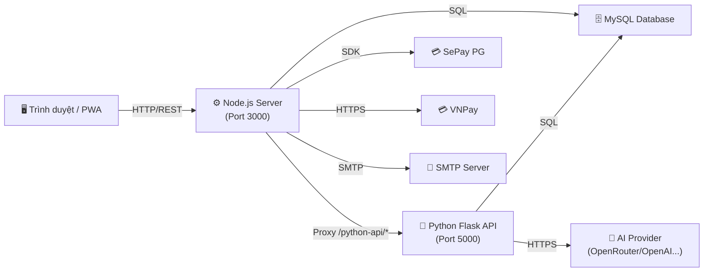
```mermaid
graph LR
    Browser["🖥️ Trình duyệt / PWA"]
    NodeJS["⚙️ Node.js Server\n(Port 3000)"]
    Python["🐍 Python Flask API\n(Port 5000)"]
    MySQL["🗄️ MySQL Database"]
    AIProvider["🤖 AI Provider\n(OpenRouter/OpenAI...)"]
    SePay["💳 SePay PG"]
    VNPay["💳 VNPay"]
    SMTP["📧 SMTP Server"]

    Browser -->|HTTP/REST| NodeJS
    NodeJS -->|Proxy /python-api/*| Python
    NodeJS -->|SQL| MySQL
    Python -->|SQL| MySQL
    Python -->|HTTPS| AIProvider
    NodeJS -->|SDK| SePay
    NodeJS -->|HTTPS| VNPay
    NodeJS -->|SMTP| SMTP
```

---

## 1. Đăng Ký Tài Khoản

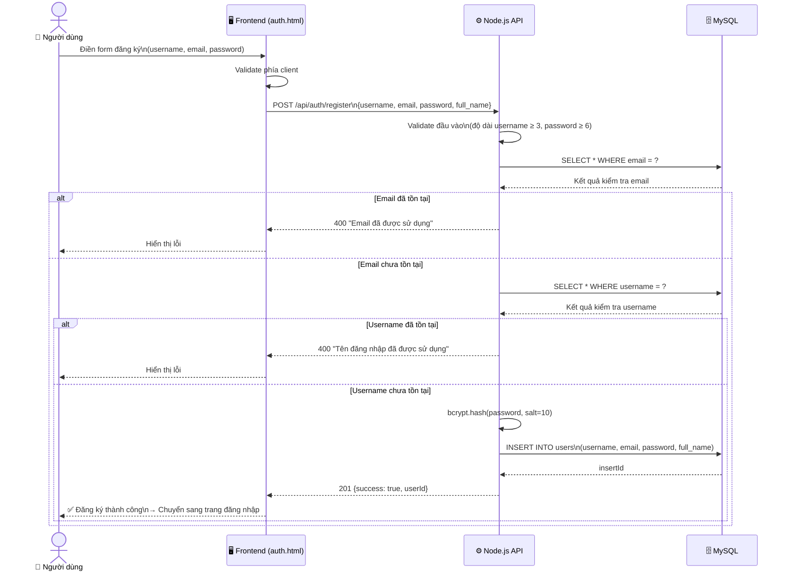
```mermaid
sequenceDiagram
    actor User as 👤 Người dùng
    participant FE as 🖥️ Frontend (auth.html)
    participant Node as ⚙️ Node.js API
    participant DB as 🗄️ MySQL

    User->>FE: Điền form đăng ký\n(username, email, password)
    FE->>FE: Validate phía client
    FE->>Node: POST /api/auth/register\n{username, email, password, full_name}
    Node->>Node: Validate đầu vào\n(độ dài username ≥ 3, password ≥ 6)
    Node->>DB: SELECT * WHERE email = ?
    DB-->>Node: Kết quả kiểm tra email
    alt Email đã tồn tại
        Node-->>FE: 400 "Email đã được sử dụng"
        FE-->>User: Hiển thị lỗi
    else Email chưa tồn tại
        Node->>DB: SELECT * WHERE username = ?
        DB-->>Node: Kết quả kiểm tra username
        alt Username đã tồn tại
            Node-->>FE: 400 "Tên đăng nhập đã được sử dụng"
            FE-->>User: Hiển thị lỗi
        else Username chưa tồn tại
            Node->>Node: bcrypt.hash(password, salt=10)
            Node->>DB: INSERT INTO users\n(username, email, password, full_name)
            DB-->>Node: insertId
            Node-->>FE: 201 {success: true, userId}
            FE-->>User: ✅ Đăng ký thành công\n→ Chuyển sang trang đăng nhập
        end
    end
```

---

## 2. Đăng Nhập (Email / Password)

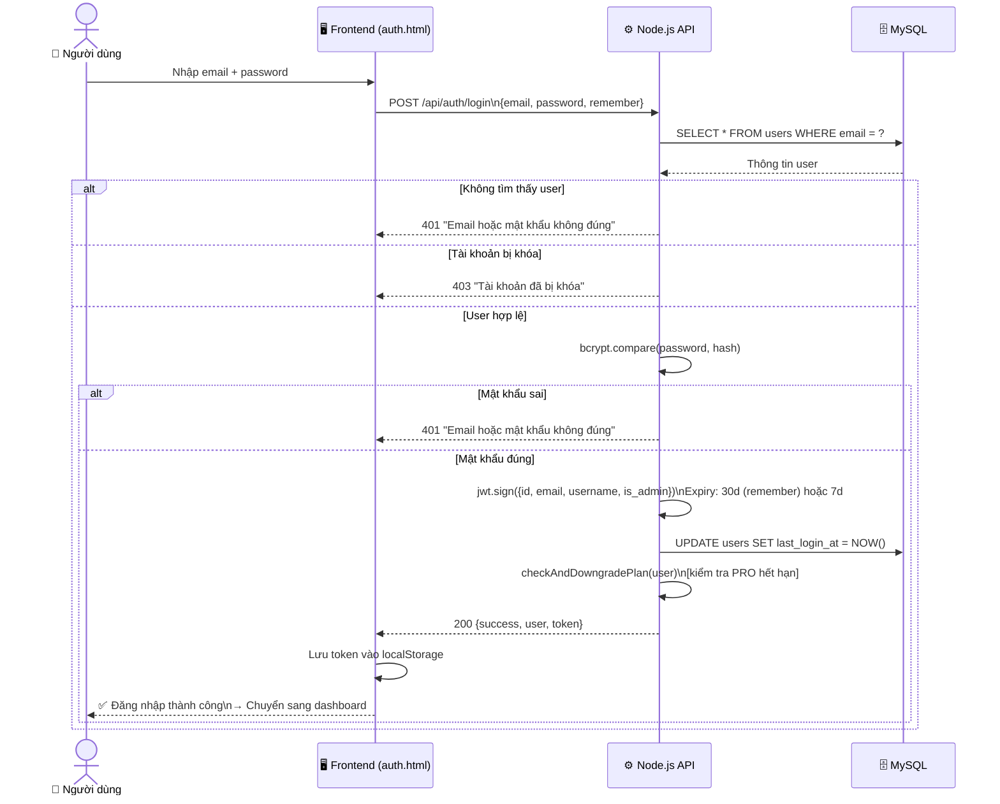
```mermaid
sequenceDiagram
    actor User as 👤 Người dùng
    participant FE as 🖥️ Frontend (auth.html)
    participant Node as ⚙️ Node.js API
    participant DB as 🗄️ MySQL

    User->>FE: Nhập email + password
    FE->>Node: POST /api/auth/login\n{email, password, remember}
    Node->>DB: SELECT * FROM users WHERE email = ?
    DB-->>Node: Thông tin user

    alt Không tìm thấy user
        Node-->>FE: 401 "Email hoặc mật khẩu không đúng"
    else Tài khoản bị khóa
        Node-->>FE: 403 "Tài khoản đã bị khóa"
    else User hợp lệ
        Node->>Node: bcrypt.compare(password, hash)
        alt Mật khẩu sai
            Node-->>FE: 401 "Email hoặc mật khẩu không đúng"
        else Mật khẩu đúng
            Node->>Node: jwt.sign({id, email, username, is_admin})\nExpiry: 30d (remember) hoặc 7d
            Node->>DB: UPDATE users SET last_login_at = NOW()
            Node->>Node: checkAndDowngradePlan(user)\n[kiểm tra PRO hết hạn]
            Node-->>FE: 200 {success, user, token}
            FE->>FE: Lưu token vào localStorage
            FE-->>User: ✅ Đăng nhập thành công\n→ Chuyển sang dashboard
        end
    end
```

---

## 3. Đăng Nhập Google OAuth

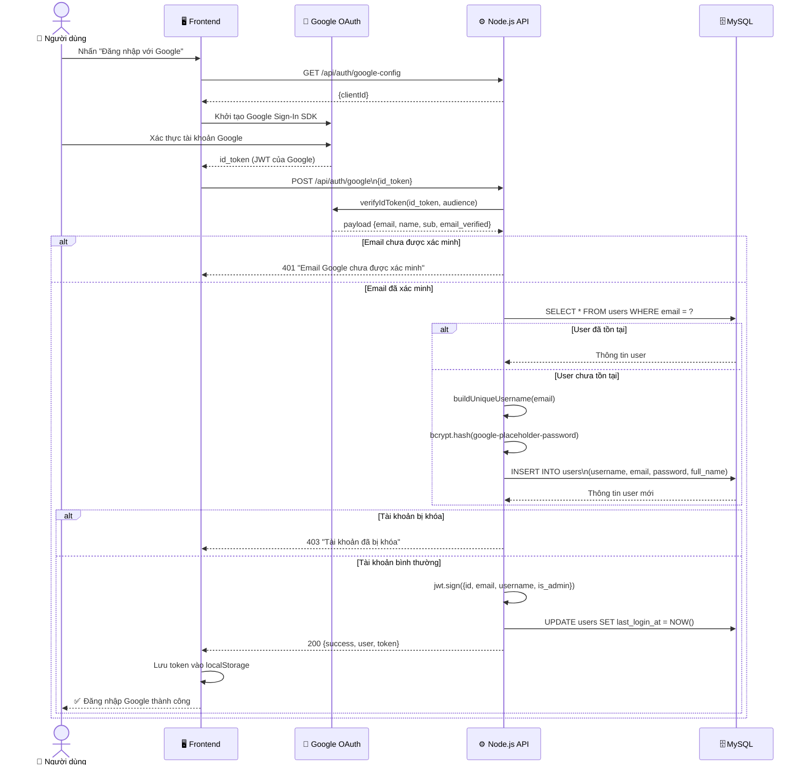
```mermaid
sequenceDiagram
    actor User as 👤 Người dùng
    participant FE as 🖥️ Frontend
    participant Google as 🔵 Google OAuth
    participant Node as ⚙️ Node.js API
    participant DB as 🗄️ MySQL

    User->>FE: Nhấn "Đăng nhập với Google"
    FE->>Node: GET /api/auth/google-config
    Node-->>FE: {clientId}
    FE->>Google: Khởi tạo Google Sign-In SDK
    User->>Google: Xác thực tài khoản Google
    Google-->>FE: id_token (JWT của Google)
    FE->>Node: POST /api/auth/google\n{id_token}
    Node->>Google: verifyIdToken(id_token, audience)
    Google-->>Node: payload {email, name, sub, email_verified}
    
    alt Email chưa được xác minh
        Node-->>FE: 401 "Email Google chưa được xác minh"
    else Email đã xác minh
        Node->>DB: SELECT * FROM users WHERE email = ?
        alt User đã tồn tại
            DB-->>Node: Thông tin user
        else User chưa tồn tại
            Node->>Node: buildUniqueUsername(email)
            Node->>Node: bcrypt.hash(google-placeholder-password)
            Node->>DB: INSERT INTO users\n(username, email, password, full_name)
            DB-->>Node: Thông tin user mới
        end
        
        alt Tài khoản bị khóa
            Node-->>FE: 403 "Tài khoản đã bị khóa"
        else Tài khoản bình thường
            Node->>Node: jwt.sign({id, email, username, is_admin})
            Node->>DB: UPDATE users SET last_login_at = NOW()
            Node-->>FE: 200 {success, user, token}
            FE->>FE: Lưu token vào localStorage
            FE-->>User: ✅ Đăng nhập Google thành công
        end
    end
```

---

## 4. Quên Mật Khẩu (OTP Email)

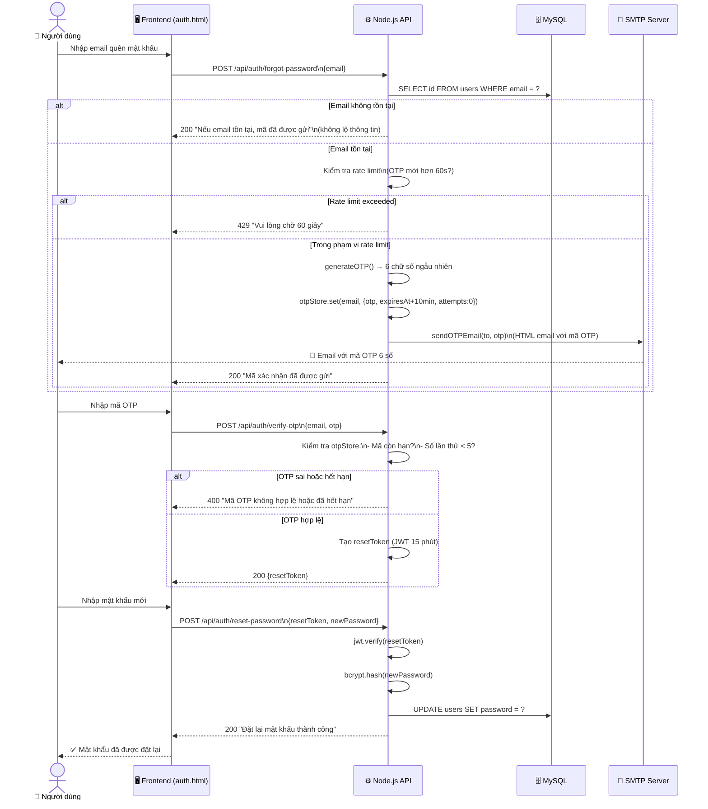
```mermaid
sequenceDiagram
    actor User as 👤 Người dùng
    participant FE as 🖥️ Frontend (auth.html)
    participant Node as ⚙️ Node.js API
    participant DB as 🗄️ MySQL
    participant SMTP as 📧 SMTP Server

    User->>FE: Nhập email quên mật khẩu
    FE->>Node: POST /api/auth/forgot-password\n{email}
    Node->>DB: SELECT id FROM users WHERE email = ?
    
    alt Email không tồn tại
        Node-->>FE: 200 "Nếu email tồn tại, mã đã được gửi"\n(không lộ thông tin)
    else Email tồn tại
        Node->>Node: Kiểm tra rate limit\n(OTP mới hơn 60s?)
        alt Rate limit exceeded
            Node-->>FE: 429 "Vui lòng chờ 60 giây"
        else Trong phạm vi rate limit
            Node->>Node: generateOTP() → 6 chữ số ngẫu nhiên
            Node->>Node: otpStore.set(email, {otp, expiresAt+10min, attempts:0})
            Node->>SMTP: sendOTPEmail(to, otp)\n(HTML email với mã OTP)
            SMTP-->>User: 📧 Email với mã OTP 6 số
            Node-->>FE: 200 "Mã xác nhận đã được gửi"
        end
    end

    User->>FE: Nhập mã OTP
    FE->>Node: POST /api/auth/verify-otp\n{email, otp}
    Node->>Node: Kiểm tra otpStore:\n- Mã còn hạn?\n- Số lần thử < 5?
    
    alt OTP sai hoặc hết hạn
        Node-->>FE: 400 "Mã OTP không hợp lệ hoặc đã hết hạn"
    else OTP hợp lệ
        Node->>Node: Tạo resetToken (JWT 15 phút)
        Node-->>FE: 200 {resetToken}
    end

    User->>FE: Nhập mật khẩu mới
    FE->>Node: POST /api/auth/reset-password\n{resetToken, newPassword}
    Node->>Node: jwt.verify(resetToken)
    Node->>Node: bcrypt.hash(newPassword)
    Node->>DB: UPDATE users SET password = ?
    Node-->>FE: 200 "Đặt lại mật khẩu thành công"
    FE-->>User: ✅ Mật khẩu đã được đặt lại
```

---

## 5. Tạo Nội Dung AI (Đồng Bộ)

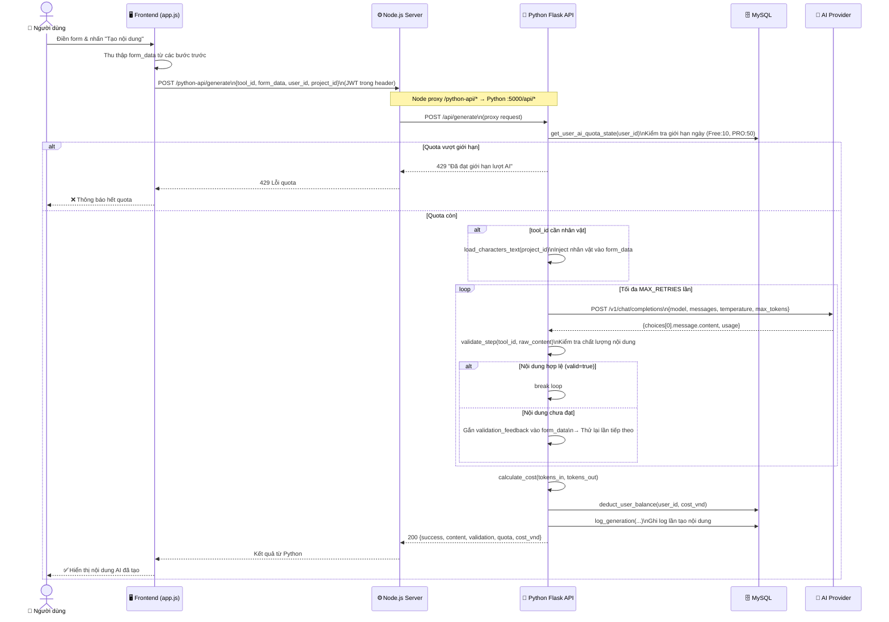
```mermaid
sequenceDiagram
    actor User as 👤 Người dùng
    participant FE as 🖥️ Frontend (app.js)
    participant Node as ⚙️ Node.js Server
    participant Python as 🐍 Python Flask API
    participant DB as 🗄️ MySQL
    participant AI as 🤖 AI Provider

    User->>FE: Điền form & nhấn "Tạo nội dung"
    FE->>FE: Thu thập form_data từ các bước trước
    FE->>Node: POST /python-api/generate\n{tool_id, form_data, user_id, project_id}\n(JWT trong header)

    Note over Node,Python: Node proxy /python-api/* → Python :5000/api/*

    Node->>Python: POST /api/generate\n(proxy request)
    
    Python->>DB: get_user_ai_quota_state(user_id)\nKiểm tra giới hạn ngày (Free:10, PRO:50)
    
    alt Quota vượt giới hạn
        Python-->>Node: 429 "Đã đạt giới hạn lượt AI"
        Node-->>FE: 429 Lỗi quota
        FE-->>User: ❌ Thông báo hết quota
    else Quota còn
        alt tool_id cần nhân vật
            Python->>Python: load_characters_text(project_id)\nInject nhân vật vào form_data
        end

        loop Tối đa MAX_RETRIES lần
            Python->>AI: POST /v1/chat/completions\n{model, messages, temperature, max_tokens}
            AI-->>Python: {choices[0].message.content, usage}
            Python->>Python: validate_step(tool_id, raw_content)\nKiểm tra chất lượng nội dung
            
            alt Nội dung hợp lệ (valid=true)
                Python->>Python: break loop
            else Nội dung chưa đạt
                Python->>Python: Gắn validation_feedback vào form_data\n→ Thử lại lần tiếp theo
            end
        end

        Python->>Python: calculate_cost(tokens_in, tokens_out)
        Python->>DB: deduct_user_balance(user_id, cost_vnd)
        Python->>DB: log_generation(...)\nGhi log lần tạo nội dung
        Python-->>Node: 200 {success, content, validation, quota, cost_vnd}
        Node-->>FE: Kết quả từ Python
        FE-->>User: ✅ Hiển thị nội dung AI đã tạo
    end
```

---

## 6. Tạo Nội Dung AI (Bất Đồng Bộ)

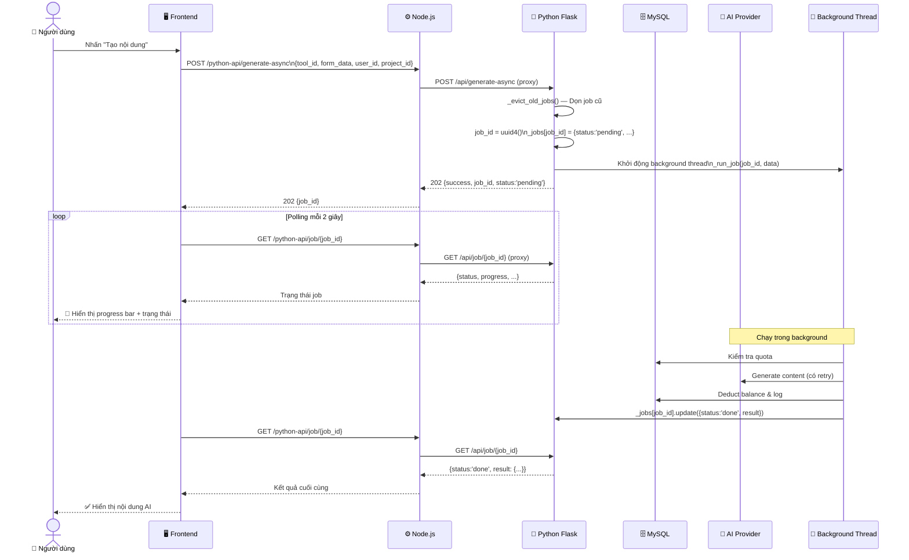
```mermaid
sequenceDiagram
    actor User as 👤 Người dùng
    participant FE as 🖥️ Frontend
    participant Node as ⚙️ Node.js
    participant Python as 🐍 Python Flask
    participant DB as 🗄️ MySQL
    participant AI as 🤖 AI Provider
    participant Thread as 🧵 Background Thread

    User->>FE: Nhấn "Tạo nội dung"
    FE->>Node: POST /python-api/generate-async\n{tool_id, form_data, user_id, project_id}
    Node->>Python: POST /api/generate-async (proxy)
    Python->>Python: _evict_old_jobs() — Dọn job cũ
    Python->>Python: job_id = uuid4()\n_jobs[job_id] = {status:'pending', ...}
    Python->>Thread: Khởi động background thread\n_run_job(job_id, data)
    Python-->>Node: 202 {success, job_id, status:'pending'}
    Node-->>FE: 202 {job_id}

    loop Polling mỗi 2 giây
        FE->>Node: GET /python-api/job/{job_id}
        Node->>Python: GET /api/job/{job_id} (proxy)
        Python-->>Node: {status, progress, ...}
        Node-->>FE: Trạng thái job
        FE-->>User: 🔄 Hiển thị progress bar + trạng thái
    end

    Note over Thread,AI: Chạy trong background
    Thread->>DB: Kiểm tra quota
    Thread->>AI: Generate content (có retry)
    Thread->>DB: Deduct balance & log
    Thread->>Python: _jobs[job_id].update({status:'done', result})

    FE->>Node: GET /python-api/job/{job_id}
    Node->>Python: GET /api/job/{job_id}
    Python-->>Node: {status:'done', result: {...}}
    Node-->>FE: Kết quả cuối cùng
    FE-->>User: ✅ Hiển thị nội dung AI
```

---

## 7. Quản Lý Nhân Vật

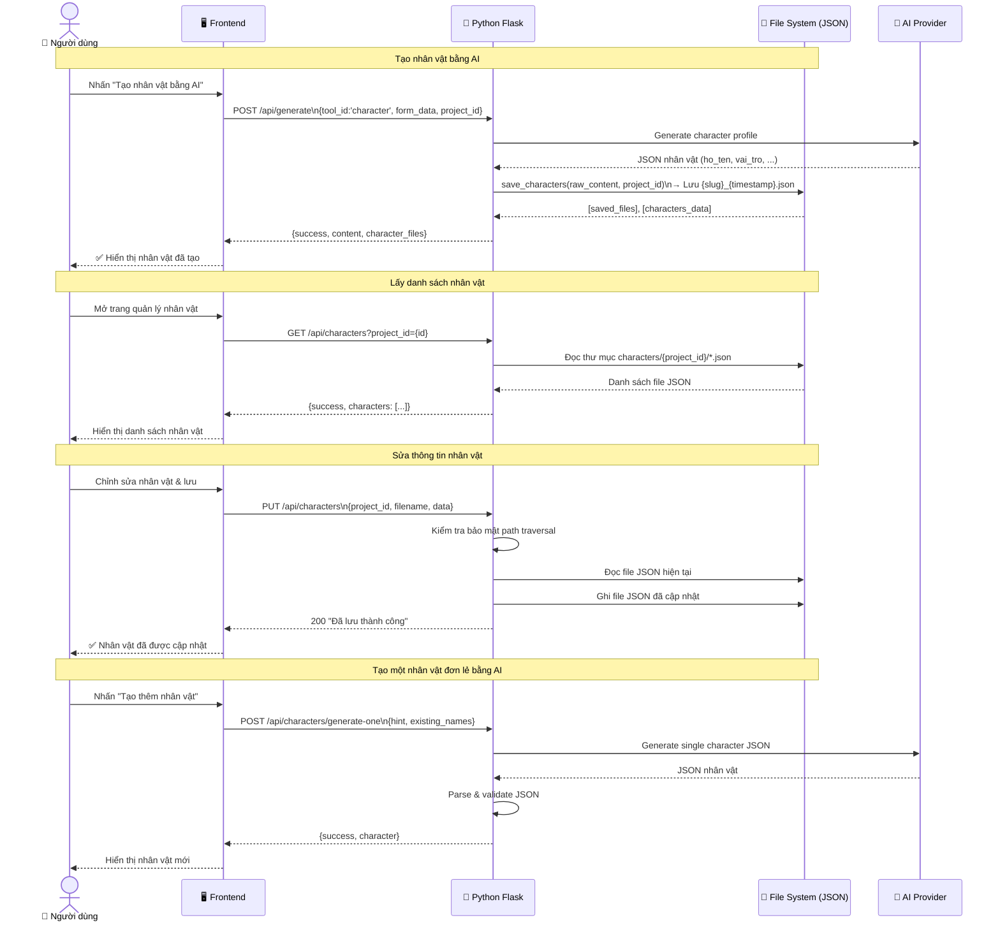
```mermaid
sequenceDiagram
    actor User as 👤 Người dùng
    participant FE as 🖥️ Frontend
    participant Python as 🐍 Python Flask
    participant FS as 📁 File System (JSON)
    participant AI as 🤖 AI Provider

    Note over User,FS: Tạo nhân vật bằng AI

    User->>FE: Nhấn "Tạo nhân vật bằng AI"
    FE->>Python: POST /api/generate\n{tool_id:'character', form_data, project_id}
    Python->>AI: Generate character profile
    AI-->>Python: JSON nhân vật (ho_ten, vai_tro, ...)
    Python->>FS: save_characters(raw_content, project_id)\n→ Lưu {slug}_{timestamp}.json
    FS-->>Python: [saved_files], [characters_data]
    Python-->>FE: {success, content, character_files}
    FE-->>User: ✅ Hiển thị nhân vật đã tạo

    Note over User,FS: Lấy danh sách nhân vật

    User->>FE: Mở trang quản lý nhân vật
    FE->>Python: GET /api/characters?project_id={id}
    Python->>FS: Đọc thư mục characters/{project_id}/*.json
    FS-->>Python: Danh sách file JSON
    Python-->>FE: {success, characters: [...]}
    FE-->>User: Hiển thị danh sách nhân vật

    Note over User,FS: Sửa thông tin nhân vật

    User->>FE: Chỉnh sửa nhân vật & lưu
    FE->>Python: PUT /api/characters\n{project_id, filename, data}
    Python->>Python: Kiểm tra bảo mật path traversal
    Python->>FS: Đọc file JSON hiện tại
    Python->>FS: Ghi file JSON đã cập nhật
    Python-->>FE: 200 "Đã lưu thành công"
    FE-->>User: ✅ Nhân vật đã được cập nhật

    Note over User,FS: Tạo một nhân vật đơn lẻ bằng AI

    User->>FE: Nhấn "Tạo thêm nhân vật"
    FE->>Python: POST /api/characters/generate-one\n{hint, existing_names}
    Python->>AI: Generate single character JSON
    AI-->>Python: JSON nhân vật
    Python->>Python: Parse & validate JSON
    Python-->>FE: {success, character}
    FE-->>User: Hiển thị nhân vật mới
```

---

## 8. Thanh Toán SePay (Nâng Cấp PRO)

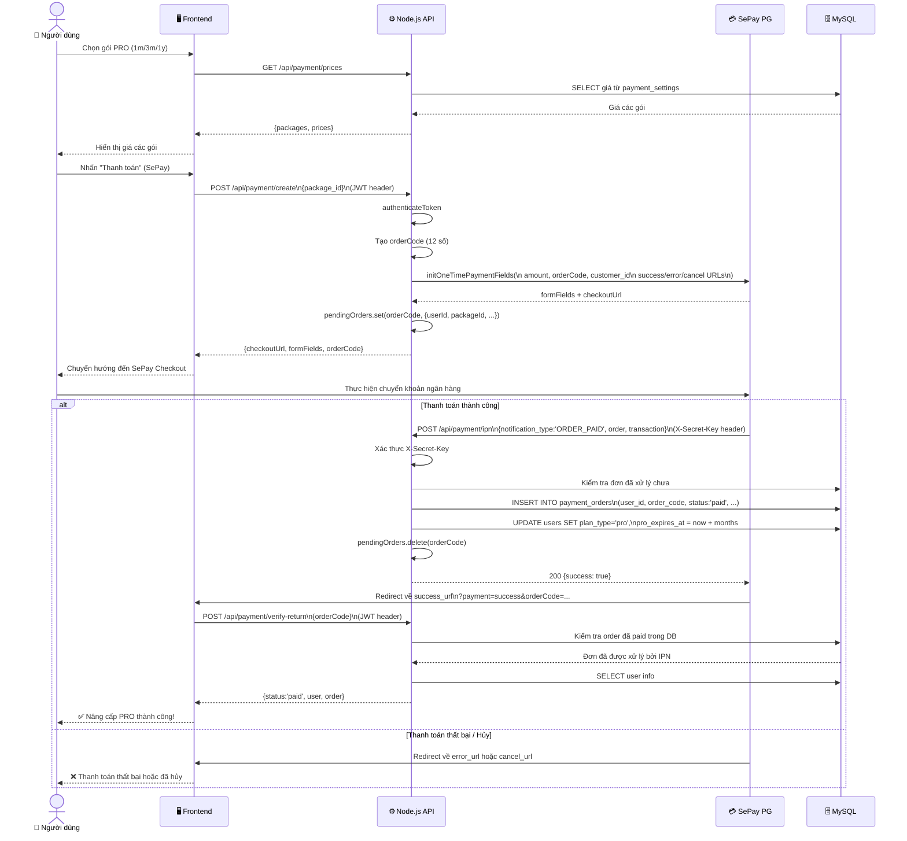
```mermaid
sequenceDiagram
    actor User as 👤 Người dùng
    participant FE as 🖥️ Frontend
    participant Node as ⚙️ Node.js API
    participant SePay as 💳 SePay PG
    participant DB as 🗄️ MySQL

    User->>FE: Chọn gói PRO (1m/3m/1y)
    FE->>Node: GET /api/payment/prices
    Node->>DB: SELECT giá từ payment_settings
    DB-->>Node: Giá các gói
    Node-->>FE: {packages, prices}
    FE-->>User: Hiển thị giá các gói

    User->>FE: Nhấn "Thanh toán" (SePay)
    FE->>Node: POST /api/payment/create\n{package_id}\n(JWT header)
    Node->>Node: authenticateToken
    Node->>Node: Tạo orderCode (12 số)
    Node->>SePay: initOneTimePaymentFields(\n  amount, orderCode, customer_id\n  success/error/cancel URLs\n)
    SePay-->>Node: formFields + checkoutUrl
    Node->>Node: pendingOrders.set(orderCode, {userId, packageId, ...})
    Node-->>FE: {checkoutUrl, formFields, orderCode}
    FE-->>User: Chuyển hướng đến SePay Checkout

    User->>SePay: Thực hiện chuyển khoản ngân hàng
    
    alt Thanh toán thành công
        SePay->>Node: POST /api/payment/ipn\n{notification_type:'ORDER_PAID', order, transaction}\n(X-Secret-Key header)
        Node->>Node: Xác thực X-Secret-Key
        Node->>DB: Kiểm tra đơn đã xử lý chưa
        Node->>DB: INSERT INTO payment_orders\n(user_id, order_code, status:'paid', ...)
        Node->>DB: UPDATE users SET plan_type='pro',\npro_expires_at = now + months
        Node->>Node: pendingOrders.delete(orderCode)
        Node-->>SePay: 200 {success: true}
        
        SePay->>FE: Redirect về success_url\n?payment=success&orderCode=...
        FE->>Node: POST /api/payment/verify-return\n{orderCode}\n(JWT header)
        Node->>DB: Kiểm tra order đã paid trong DB
        DB-->>Node: Đơn đã được xử lý bởi IPN
        Node->>DB: SELECT user info
        Node-->>FE: {status:'paid', user, order}
        FE-->>User: ✅ Nâng cấp PRO thành công!
    else Thanh toán thất bại / Hủy
        SePay->>FE: Redirect về error_url hoặc cancel_url
        FE-->>User: ❌ Thanh toán thất bại hoặc đã hủy
    end
```

---

## 9. Thanh Toán VNPay

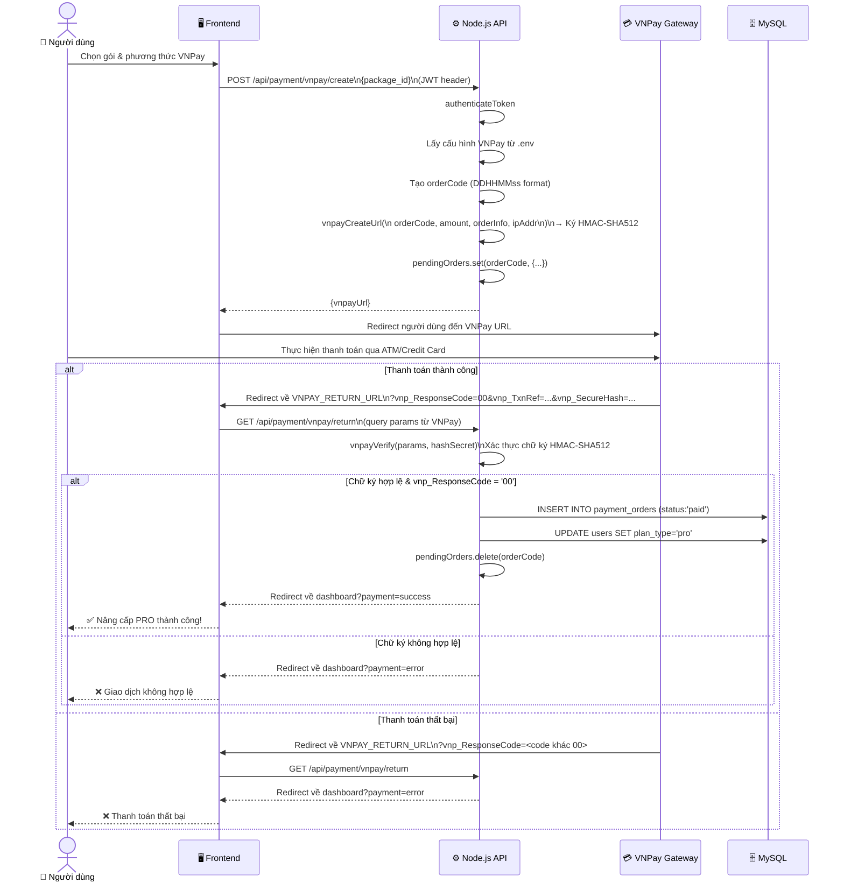
```mermaid
sequenceDiagram
    actor User as 👤 Người dùng
    participant FE as 🖥️ Frontend
    participant Node as ⚙️ Node.js API
    participant VNPay as 💳 VNPay Gateway
    participant DB as 🗄️ MySQL

    User->>FE: Chọn gói & phương thức VNPay
    FE->>Node: POST /api/payment/vnpay/create\n{package_id}\n(JWT header)
    Node->>Node: authenticateToken
    Node->>Node: Lấy cấu hình VNPay từ .env
    Node->>Node: Tạo orderCode (DDHHMMss format)
    Node->>Node: vnpayCreateUrl(\n  orderCode, amount, orderInfo, ipAddr\n)\n→ Ký HMAC-SHA512
    Node->>Node: pendingOrders.set(orderCode, {...})
    Node-->>FE: {vnpayUrl}
    FE->>VNPay: Redirect người dùng đến VNPay URL

    User->>VNPay: Thực hiện thanh toán qua ATM/Credit Card
    
    alt Thanh toán thành công
        VNPay->>FE: Redirect về VNPAY_RETURN_URL\n?vnp_ResponseCode=00&vnp_TxnRef=...&vnp_SecureHash=...
        FE->>Node: GET /api/payment/vnpay/return\n(query params từ VNPay)
        Node->>Node: vnpayVerify(params, hashSecret)\nXác thực chữ ký HMAC-SHA512
        alt Chữ ký hợp lệ & vnp_ResponseCode = '00'
            Node->>DB: INSERT INTO payment_orders (status:'paid')
            Node->>DB: UPDATE users SET plan_type='pro'
            Node->>Node: pendingOrders.delete(orderCode)
            Node-->>FE: Redirect về dashboard?payment=success
            FE-->>User: ✅ Nâng cấp PRO thành công!
        else Chữ ký không hợp lệ
            Node-->>FE: Redirect về dashboard?payment=error
            FE-->>User: ❌ Giao dịch không hợp lệ
        end
    else Thanh toán thất bại
        VNPay->>FE: Redirect về VNPAY_RETURN_URL\n?vnp_ResponseCode=<code khác 00>
        FE->>Node: GET /api/payment/vnpay/return
        Node-->>FE: Redirect về dashboard?payment=error
        FE-->>User: ❌ Thanh toán thất bại
    end
```

---

## 10. Quản Lý Dự Án

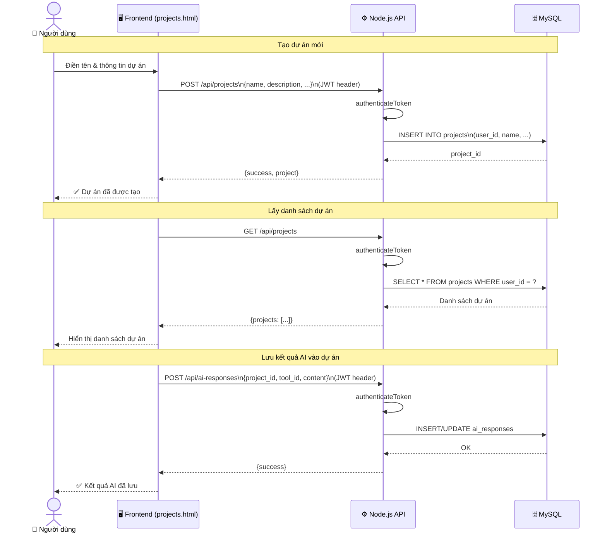
```mermaid
sequenceDiagram
    actor User as 👤 Người dùng
    participant FE as 🖥️ Frontend (projects.html)
    participant Node as ⚙️ Node.js API
    participant DB as 🗄️ MySQL

    Note over User,DB: Tạo dự án mới
    User->>FE: Điền tên & thông tin dự án
    FE->>Node: POST /api/projects\n{name, description, ...}\n(JWT header)
    Node->>Node: authenticateToken
    Node->>DB: INSERT INTO projects\n(user_id, name, ...)
    DB-->>Node: project_id
    Node-->>FE: {success, project}
    FE-->>User: ✅ Dự án đã được tạo

    Note over User,DB: Lấy danh sách dự án
    FE->>Node: GET /api/projects
    Node->>Node: authenticateToken
    Node->>DB: SELECT * FROM projects WHERE user_id = ?
    DB-->>Node: Danh sách dự án
    Node-->>FE: {projects: [...]}
    FE-->>User: Hiển thị danh sách dự án

    Note over User,DB: Lưu kết quả AI vào dự án
    FE->>Node: POST /api/ai-responses\n{project_id, tool_id, content}\n(JWT header)
    Node->>Node: authenticateToken
    Node->>DB: INSERT/UPDATE ai_responses
    DB-->>Node: OK
    Node-->>FE: {success}
    FE-->>User: ✅ Kết quả AI đã lưu
```

---

## 11. Admin — Quản Trị Hệ Thống

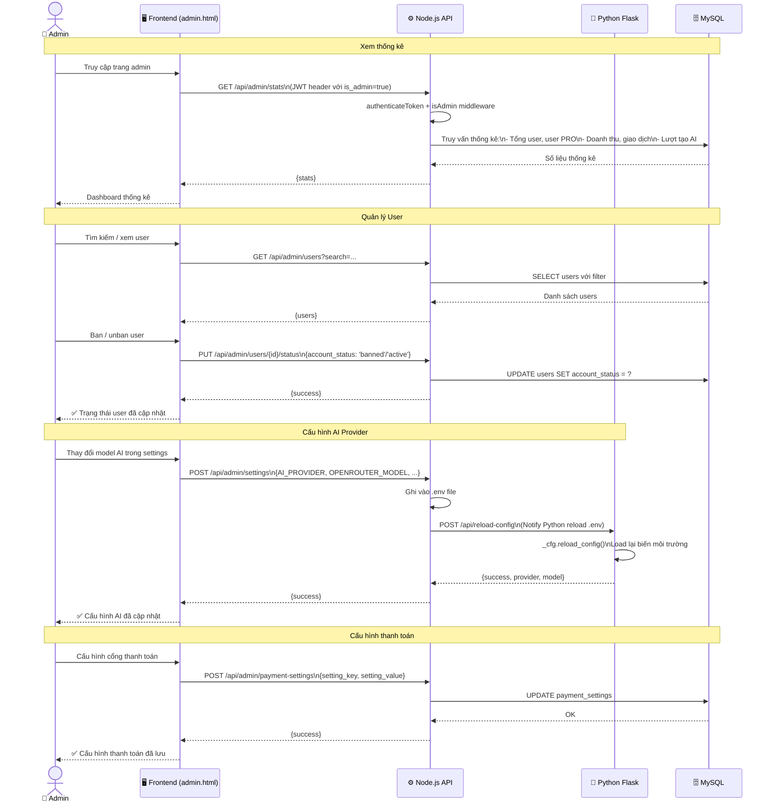
```mermaid
sequenceDiagram
    actor Admin as 👑 Admin
    participant FE as 🖥️ Frontend (admin.html)
    participant Node as ⚙️ Node.js API
    participant Python as 🐍 Python Flask
    participant DB as 🗄️ MySQL

    Note over Admin,DB: Xem thống kê
    Admin->>FE: Truy cập trang admin
    FE->>Node: GET /api/admin/stats\n(JWT header với is_admin=true)
    Node->>Node: authenticateToken + isAdmin middleware
    Node->>DB: Truy vấn thống kê:\n- Tổng user, user PRO\n- Doanh thu, giao dịch\n- Lượt tạo AI
    DB-->>Node: Số liệu thống kê
    Node-->>FE: {stats}
    FE-->>Admin: Dashboard thống kê

    Note over Admin,DB: Quản lý User
    Admin->>FE: Tìm kiếm / xem user
    FE->>Node: GET /api/admin/users?search=...
    Node->>DB: SELECT users với filter
    DB-->>Node: Danh sách users
    Node-->>FE: {users}
    
    Admin->>FE: Ban / unban user
    FE->>Node: PUT /api/admin/users/{id}/status\n{account_status: 'banned'/'active'}
    Node->>DB: UPDATE users SET account_status = ?
    Node-->>FE: {success}
    FE-->>Admin: ✅ Trạng thái user đã cập nhật

    Note over Admin,Python: Cấu hình AI Provider
    Admin->>FE: Thay đổi model AI trong settings
    FE->>Node: POST /api/admin/settings\n{AI_PROVIDER, OPENROUTER_MODEL, ...}
    Node->>Node: Ghi vào .env file
    Node->>Python: POST /api/reload-config\n(Notify Python reload .env)
    Python->>Python: _cfg.reload_config()\nLoad lại biến môi trường
    Python-->>Node: {success, provider, model}
    Node-->>FE: {success}
    FE-->>Admin: ✅ Cấu hình AI đã cập nhật

    Note over Admin,DB: Cấu hình thanh toán
    Admin->>FE: Cấu hình cổng thanh toán
    FE->>Node: POST /api/admin/payment-settings\n{setting_key, setting_value}
    Node->>DB: UPDATE payment_settings
    DB-->>Node: OK
    Node-->>FE: {success}
    FE-->>Admin: ✅ Cấu hình thanh toán đã lưu
```

---

## 12. Tự Động Hạ Cấp PRO Hết Hạn

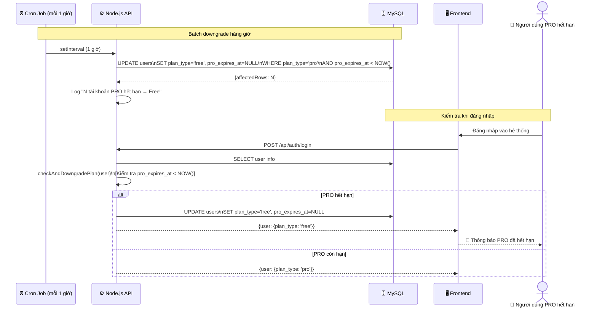
```mermaid
sequenceDiagram
    participant Cron as ⏰ Cron Job (mỗi 1 giờ)
    participant Node as ⚙️ Node.js API
    participant DB as 🗄️ MySQL
    participant FE as 🖥️ Frontend
    actor User as 👤 Người dùng PRO hết hạn

    Note over Cron,DB: Batch downgrade hàng giờ
    Cron->>Node: setInterval (1 giờ)
    Node->>DB: UPDATE users\nSET plan_type='free', pro_expires_at=NULL\nWHERE plan_type='pro'\nAND pro_expires_at < NOW()
    DB-->>Node: {affectedRows: N}
    Node->>Node: Log "N tài khoản PRO hết hạn → Free"

    Note over User,DB: Kiểm tra khi đăng nhập
    User->>FE: Đăng nhập vào hệ thống
    FE->>Node: POST /api/auth/login
    Node->>DB: SELECT user info
    Node->>Node: checkAndDowngradePlan(user)\n[Kiểm tra pro_expires_at < NOW()]
    alt PRO hết hạn
        Node->>DB: UPDATE users\nSET plan_type='free', pro_expires_at=NULL
        Node-->>FE: {user: {plan_type: 'free'}}
        FE-->>User: 🔔 Thông báo PRO đã hết hạn
    else PRO còn hạn
        Node-->>FE: {user: {plan_type: 'pro'}}
    end
```

---

## 13. Luồng Tổng Thể Tạo Kịch Bản Phim

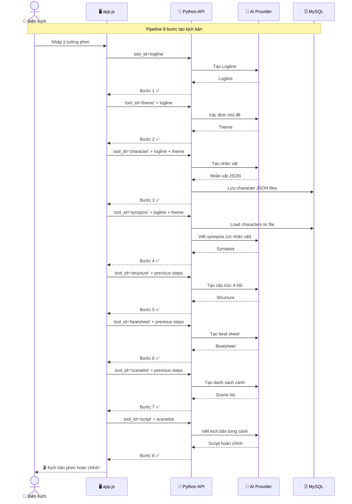
```mermaid
sequenceDiagram
    actor User as 👤 Biên Kịch
    participant FE as 🖥️ app.js
    participant Python as 🐍 Python API
    participant AI as 🤖 AI Provider
    participant DB as 🗄️ MySQL

    Note over User,DB: Pipeline 8 bước tạo kịch bản
    
    User->>FE: Nhập ý tưởng phim
    FE->>Python: tool_id='logline'
    Python->>AI: Tạo Logline
    AI-->>Python: Logline
    Python-->>FE: Bước 1 ✅

    FE->>Python: tool_id='theme' + logline
    Python->>AI: Xác định chủ đề
    AI-->>Python: Theme
    Python-->>FE: Bước 2 ✅

    FE->>Python: tool_id='character' + logline + theme
    Python->>AI: Tạo nhân vật
    AI-->>Python: Nhân vật JSON
    Python->>DB: Lưu character JSON files
    Python-->>FE: Bước 3 ✅

    FE->>Python: tool_id='synopsis' + logline + theme
    Python->>DB: Load characters từ file
    Python->>AI: Viết synopsis (có nhân vật)
    AI-->>Python: Synopsis
    Python-->>FE: Bước 4 ✅

    FE->>Python: tool_id='structure' + previous steps
    Python->>AI: Tạo cấu trúc 4 hồi
    AI-->>Python: Structure
    Python-->>FE: Bước 5 ✅

    FE->>Python: tool_id='beatsheet' + previous steps
    Python->>AI: Tạo beat sheet
    AI-->>Python: Beatsheet
    Python-->>FE: Bước 6 ✅

    FE->>Python: tool_id='scenelist' + previous steps
    Python->>AI: Tạo danh sách cảnh
    AI-->>Python: Scene list
    Python-->>FE: Bước 7 ✅

    FE->>Python: tool_id='script' + scenelist
    Python->>AI: Viết kịch bản từng cảnh
    AI-->>Python: Script hoàn chỉnh
    Python-->>FE: Bước 8 ✅

    FE-->>User: 🎬 Kịch bản phim hoàn chỉnh!
```

---

> [!NOTE]
> Tất cả các request có xác thực đều yêu cầu JWT token trong header `Authorization: Bearer <token>`. Token có hiệu lực 7 ngày (hoặc 30 ngày nếu chọn "Ghi nhớ đăng nhập").

> [!TIP]
> Hệ thống sử dụng hai kiến trúc song song: **Node.js** (port 3000) xử lý auth/payment/DB, còn **Python Flask** (port 5000) chuyên xử lý AI generation. Node proxy các request `/python-api/*` sang Python.
